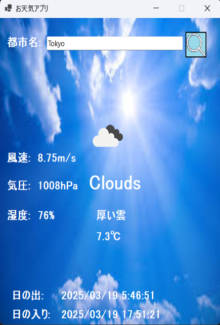

# お天気アプリ(C# Windows Forms版)
OpenWeatherMap API を利用してリアルタイムの天気情報を取得し、表示するお天気アプリのC# WinForms版になります。



## 特徴
- **ローマ字で地名を入力して天気を検索**
- **現在の天気、詳細説明、温度、湿度、風速、気圧を表示**
- **日の出・日の入り時間も取得**
- **天候アイコン表示**
- **OpenWeatherMap API使用**
- **日本語表示対応**

## 🛠️ 使用技術
- **C#(.NET Framework/.NET 6+)**
- **Windows Forms**
- **OpenWeatherMap**
- **Newtonsoft.Json**

## 🌐 APIキーを設定
このアプリを実行するには、**OpenWeatherMap APIキー**が必要です。
1. [OpenWeatherMapのAPIキー取得ページ](https://home.openweathermap.org/api_keys)から無料のAPIキーを取得
2. `Form1.cs`の`APIKey`に設定
```csharp
String APIKey = "あなたのAPIキー";
```
## 🚀 実行方法
1. 必要環境
- Visual Studio 2022 以降
- .NET Framework または .NET 6+

2. リポジトリのクローン(ダウンロード)

   ターミナルまたはコマンドプロンプトで以下を実行:
```sh
git clone https://github.com/motomasMINO/WeatherApp-Csharp.git
cd WeatherApp-Csharp
```
3.実行(アプリを起動)
```sh
dotnet run --project WeatherApp
```
※ WeatherApp.exeをダブルクリックしても起動することが出来ます。

## 📜 ライセンス
このプロジェクトはMIT Licenseのもとで公開されています。

## 📧 お問い合わせ
- **Github: motomasMINO**

- **Email: yu120615@gmail.com**

  バグ報告や改善点・機能追加の提案はPull RequestまたはIssueで受け付けています!